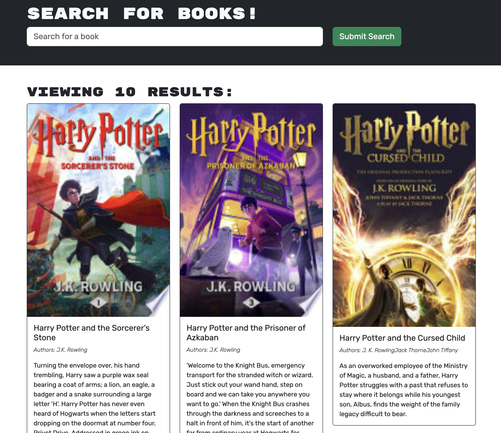

<a name="readme-top"></a>

[![Contributors][contributors-shield]][contributors-url]
[![Forks][forks-shield]][forks-url]
[![Stargazers][stars-shield]][stars-url]
[![Issues][issues-shield]][issues-url]
[![MIT License][license-shield]][license-url]
[![LinkedIn][linkedin-shield]][linkedin-url]
</br>

<br />
<div align="center">
  <a href="https://github.com/beckpull/book-search">

<h1 align="center">Google Books Search Engine</h1>

  <p align="center">Short desc
    <br />
    <a href="https://github.com/beckpull/book-search"><strong>Explore the docs »</strong></a>
    <br />
    <br />
    <a href="https://book-search-evj9.onrender.com/">View Webpage</a>
    ·
    <a href="https://github.com/beckpull/book-search/issues">Report Bug</a>
    ·
    <a href="https://github.com/beckpull/book-search/issues">Request Feature</a>
  </p>
</div>

</br>
</br>

<!-- TABLE OF CONTENTS -->
<details>
  <summary>Table of Contents</summary>
  <ol>
    <li>
      <a href="#about-the-project">About The Project</a>
      <ul>
        <li><a href="#built-with">Built With</a></li>
      </ul>
    </li>
    <li>
      <a href="#getting-started">Getting Started</a>
      <ul>
        <li><a href="#prerequisites">Prerequisites</a></li>
        <li><a href="#installation">Installation</a></li>
      </ul>
    </li>
    <li><a href="#usage">Usage</a></li>
    <li><a href="#roadmap">Roadmap</a></li>
    <li><a href="#contributing">Contributing</a></li>
    <li><a href="#license">License</a></li>
    <li><a href="#contact">Contact</a></li>
     <li><a href="#acknowledgments">Acknowledgments</a></li>
  </ol>
</details>

</br>
</br>

<!-- ABOUT THE PROJECT -->

## About The Project

The project initially started with a traditional Express setup using an MVC (Model-View-Controller) structure. The routes and controllers managed RESTful API endpoints for user authentication and book search functionalities. While this setup was functional, I aimed for a more flexible and efficient solution to handle complex data fetching requirements.

I transitioned the application to utilize Apollo Server and GraphQL, which significantly enhanced the efficiency and flexibility of data fetching. Apollo Server was configured to handle GraphQL requests, and the schema was meticulously defined using typeDefs and resolvers.

### Overview:

This application not only provides a seamless user experience for searching books but also integrates user authentication and personalized book saving features. The project showcases my expertise in leveraging cutting-edge technologies such as MongoDB, Apollo Client, Apollo Server, GraphQL, JWT tokens, and custom authentication middleware. By transitioning from a standard Express application with controllers and routes to a sophisticated Apollo-based architecture, I ensured a more efficient and scalable solution.

### Key Features:

- **Responsive Design**: Ensures optimal viewing experience across various devices and screen sizes.
- **Interactive Interface**: Engages users with intuitive navigation and interactive elements.
- **Project Showcase**: Highlights my projects, including descriptions, technologies used, and links to live demos or repositories.
- **Skills Section**: Showcases my technical skills and proficiencies relevant to web development.
- **About Me Page**: Provides insight into my background, experience, and interests.
- **Contact Form**: Enables visitors to reach out to me directly for inquiries or collaborations.

### Technologies Used:

- **Frontend**: React.js, Apollo Client, GraphQL
- **Backend**: MongoDB, Mongoose, Apollo Server, GraphQL, Node.js, Express
- **Authentication**: JWT tokens, jwt-decode, custom authentication middleware
- **Deployment**: Render

### Goals:

The primary goal of this project was to create a professional and visually appealing platform that demonstrates my proficiency in modern web development. By leveraging Apollo Client and Server, GraphQL, MongoDB, and JWT authentication, I ensured that the application is both scalable and efficient. This project serves as a testament to my ability to convert a standard Express application into a sophisticated, modern web application with enhanced functionality and user experience.

<p align="right">(<a href="#readme-top">back to top</a>)</p>

### Built With

- 
- 
- ![NodeJS]
- 
- 
- 
- 
- 

<p align="right">(<a href="#readme-top">back to top</a>)</p>

<!-- GETTING STARTED -->
## Getting Started

### Prerequisites

_This application has several dependencies, to install individually onto your machine, navigate to the directory this code lives in and type these commands into your Terminal / Git Bash:_

<!-- ```sh
#   npm i express
#   npm i mongodb
#   npm i mongoose
#   npm i nodemon --save-dev
``` -->


### Installation

_To get a local copy up and running follow these simple example steps:_

1. Clone the repo
   ```sh
   HTTP: git clone https://github.com/beckpull/book-search.git
   SSH: git clone git@github.com:beckpull/book-search.git
   ```
2. Install all necessary NPM packages
   ```sh
   npm i && npm run build
   ```
3. Node `server.js`
   ```sh
   npm start 
   ```

<p align="right">(<a href="#readme-top">back to top</a>)</p>

<!-- USAGE EXAMPLES -->

## Usage

</br></br>

<p align="center"><i><strong>✨ Everything you need to know ✨</strong></i></p>

<div align="center"> 
  
  </br>
  </br>
  <strong><i>Scan the QR code above or click <strong><a href="https://book-search-evj9.onrender.com/">HERE</a></strong> to view this deployed site on Netlify!</strong>
    </br>
    </br>
    </br>
    <a href="https://book-search-evj9.onrender.com/">
    <p>Search Books, Save Book</p>
      <!--  -->
      
      
    </a>
    </br></br>
    <a href="https://book-search-evj9.onrender.com/">
      <p>Signup, See My Books</p>
      <!--  -->
      
      
    </a>
    </br></br>
  </br></br>
</div>

<p align="right">(<a href="#readme-top">back to top</a>)</p>

<!-- ROADMAP -->

## Roadmap


<div align="right">
  <p><i>This was my roadmap for this project</i></p>
</div>
</br>

<!-- AS AN avid reader
I WANT to search for new books to read
SO THAT I can keep a list of books to purchase -->

<!-- GIVEN a book search engine
WHEN I load the search engine
THEN I am presented with a menu with the options Search for Books and Login/Signup and an input field to search for books and a submit button
WHEN I click on the Search for Books menu option
THEN I am presented with an input field to search for books and a submit button
WHEN I am not logged in and enter a search term in the input field and click the submit button
THEN I am presented with several search results, each featuring a book’s title, author, description, image, and a link to that book on the Google Books site
WHEN I click on the Login/Signup menu option
THEN a modal appears on the screen with a toggle between the option to log in or sign up
WHEN the toggle is set to Signup
THEN I am presented with three inputs for a username, an email address, and a password, and a signup button
WHEN the toggle is set to Login
THEN I am presented with two inputs for an email address and a password and login button
WHEN I enter a valid email address and create a password and click on the signup button
THEN my user account is created and I am logged in to the site
WHEN I enter my account’s email address and password and click on the login button
THEN I the modal closes and I am logged in to the site
WHEN I am logged in to the site
THEN the menu options change to Search for Books, an option to see my saved books, and Logout
WHEN I am logged in and enter a search term in the input field and click the submit button
THEN I am presented with several search results, each featuring a book’s title, author, description, image, and a link to that book on the Google Books site and a button to save a book to my account
WHEN I click on the Save button on a book
THEN that book’s information is saved to my account
WHEN I click on the option to see my saved books
THEN I am presented with all of the books I have saved to my account, each featuring the book’s title, author, description, image, and a link to that book on the Google Books site and a button to remove a book from my account
WHEN I click on the Remove button on a book
THEN that book is deleted from my saved books list
WHEN I click on the Logout button
THEN I am logged out of the site and presented with a menu with the options Search for Books and Login/Signup and an input field to search for books and a submit button -->

<p align="right">(<a href="#readme-top">back to top</a>)</p>

<!-- CONTRIBUTING -->

## Contributing

Contributions are what make the open source community such an amazing place to learn, inspire, and create. Any contributions you make are **greatly appreciated**!

_If you have a suggestion that would make this better, please fork the repo and create a pull request. You can also simply open an issue with the tag "enhancement".
Don't forget to give the project a star! Thanks again!_

1. Fork the Project
2. Create your Feature Branch (`git checkout -b feature/NewFeature`)
3. Commit your Changes (`git commit -m 'Added ______ , NewFeature'`)
4. Push to the Branch (`git push origin feature/NewFeature`)
5. Open a Pull Request

See the [open issues](https://github.com/beckpull/book-search/issues) for a full list of proposed features (and known issues).

<p align="right">(<a href="#readme-top">back to top</a>)</p>

<!-- LICENSE -->

## License

<p align='center'>Distributed under the MIT License. See `LICENSE.txt` for more information.</p>
<p align='center'>© Beck Feltman · All rights reserved.</p>

<p align="right">(<a href="#readme-top">back to top</a>)</p>

<!-- CONTACT -->

## Contact

**Rebecca Feltman** - [Email me](mailto:beckpull@icloud.com) - or check me out on [GitHub](https://github.com/beckpull) or [LinkedIn!](https://linkedin/in/beckpull)

> Repository Link: [https://github.com/beckpull/book-search](https://github.com/beckpull/book-search)

<p align="right">(<a href="#readme-top">back to top</a>)</p>

<!-- ACKNOWLEDGMENTS -->

## Acknowledgments

- This README file template was created by [@othneildrew](https://github.com/othneildrew) - the original can be found [here](https://github.com/othneildrew/Best-README-Template)
* Huge thank you to my friend [@NathaliaReyes](https://github.com/nathaliareyes) for all of your help, support, and collaboration through this project ✨

#### Disclaimer:

> I utilized several articles from sources such as (but not limited to) Stack Overflow, W3Schools, and MDN Web Docs, as well as many classwork example code from the University of Denver **as references** for the javascript code attached.
>
> **All of the utilized information has been altered in order to fit this project. This repository contains _solely_ my own work (in addition to the DU starter code for this assignemnt).**

<p align="right">(<a href="#readme-top">back to top</a>)</p>

<!-- MARKDOWN LINKS & IMAGES -->
<!-- https://www.markdownguide.org/basic-syntax/#reference-style-links -->

[contributors-shield]: https://img.shields.io/github/contributors/beckpull/book-search.svg?style=for-the-badge
[contributors-url]: https://github.com/beckpull/book-search/graphs/contributors
[forks-shield]: https://img.shields.io/github/forks/beckpull/book-search.svg?style=for-the-badge
[forks-url]: https://github.com/beckpull/book-search/network/members
[stars-shield]: https://img.shields.io/github/stars/beckpull/book-search.svg?style=for-the-badge
[stars-url]: https://github.com/beckpull/book-search/stargazers
[issues-shield]: https://img.shields.io/github/issues/beckpull/book-search.svg?style=for-the-badge
[issues-url]: https://github.com/beckpull/book-search/issues
[license-shield]: https://img.shields.io/github/license/beckpull/book-search.svg?style=for-the-badge
[license-url]: https://github.com/beckpull/book-search/blob/main/LICENSE
[product-screenshot]: images/screenshot.png
[NodeJS]: https://img.shields.io/badge/node.js-6DA55F?style=for-the-badge&logo=node.js&logoColor=white
[Node-url]: https://nodejs.org/en
[JQuery.com]: https://img.shields.io/badge/jQuery-0769AD?style=for-the-badge&logo=jquery&logoColor=white
[JQuery-url]: https://jquery.com
[Bulma]: https://img.shields.io/badge/bulma-00D0B1?style=for-the-badge&logo=bulma&logoColor=white
[linkedin-shield]: https://img.shields.io/badge/linkedin-%230077B5.svg?style=for-the-badge&logo=linkedin&logoColor=white
[linkedin-url]: https://linkedin.com/in/beckpull/
[stackoverflow-shield]: https://img.shields.io/badge/-Stackoverflow-FE7A16?style=for-the-badge&logo=stack-overflow&logoColor=white
[jest-shield]: https://img.shields.io/badge/-jest-%23C21325?style=for-the-badge&logo=jest&logoColor=white
[inquirer-shield]: https://img.shields.io/badge/dependency-inquirer-black
[inquirer-url]: https://www.npmjs.com/package/inquirer
